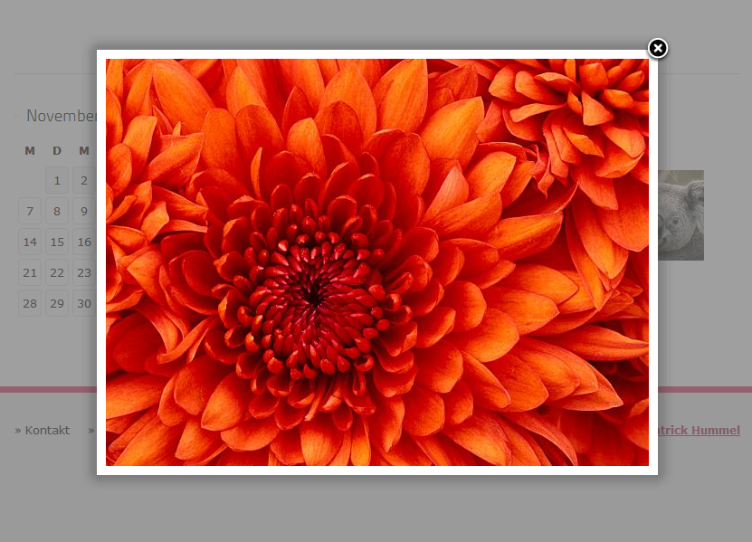

.. ==================================================
.. FOR YOUR INFORMATION
.. --------------------------------------------------
.. -*- coding: utf-8 -*- with BOM.

.. include:: ../Includes.txt

.. _introduction:

Introduction
============

.. _what-it-does:

What does it do?
----------------

The Lightbox Gallery extension for Typo3 basically gives backend-users the possibility to display a folder of image files in a beautiful lightbox gallery without any efford.

You just have to add the plugin and choose the folder, everything will run out of the box! The extension automatically generates thumbnail versions of all the image files and displays them, clicking on one opens the lightbox showing the images, scaled to fit the display. This works with any image-size automatically, so the editor does not have to edit or scale the images before uploading.

.. _screenshots:

Screenshots
-----------

